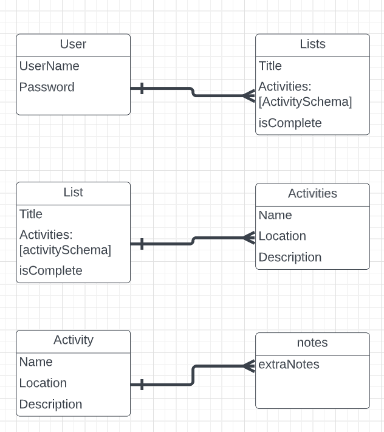

## TO-DO APP
>This app is meant to track your daily to-do's so you don't have to cram every little thing in your mind! Start by signing up/in, then list and save your to-do's!

## TECHNOLOGIES USED
1. Javascript
2. HTML
3. CSS
4. Mongoose
5. Mongodb
6. Nodemon
7. Express
8. Cors
9. Passport
10. Passport-Jwt
11. Node

## WIREFRAMES
>Sign in/up

>After sign in

>login your to-do

## ERD LIST
**Fields**
1. User
> userName,
> password

2. Lists
**Fields**
> title
> activitySchema
> isComplete

3. Activites
**Fields**
> name
> location,
> description

## GETTING STARTED
> Log into the app,
> Click on the date you'd like to list your to-do
> List in your to-do('s)
> Save your to-do

## USER STORIES

> TIER 1
1. As a user I want to login the app
2. As a user I want to logout of the app
3. As a user I want to know I've successfully logged in
4. As a user I want to know I've successfully logged out
5. As a user I want to see my to-dos because I want to know that the app is doing as advertised
6. As a user I want to know when I've completed a to-do so that i can keep track of how many things I have to do and how many things I've done
7. As a user I want to see my login page 
8. As a user I want to see my to-do page 

>Tier 2
1. As a user I want to set a deadline for my to-do's so I can get them done in a certain timeframe

2. As a user I want to have a profile picture because I want my profile to be tailored to what I like

3. As a user I want to I want to edit my to-do because I may not want to to that anymore

>TIER 3
1. customizable avatars for profile pics because I want my profile to be more fun and interactive